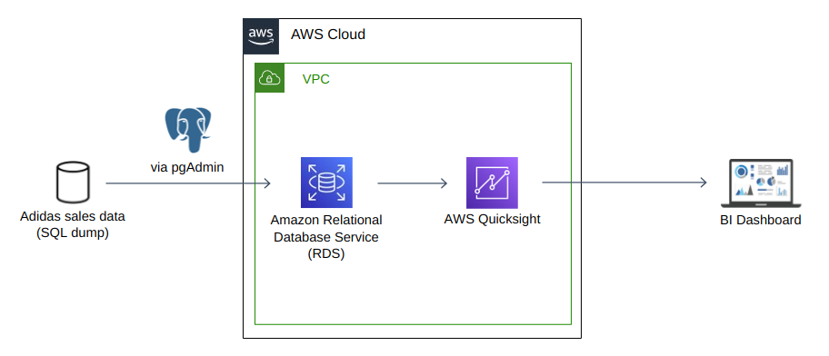

<!-- PROJECT LOGO -->
 

  

  <h1 align="center"> Adidas Sales BI Dashboard</h1>

   

A BI dashboard desgined using AWS QuickSight by leveraging Adidas's US sales data consolidated in an AWS RDS PostgreSQL database.
 
Project Organization
------------

    ├── LICENSE                  
    ├── README.md              <- The top-level README for developers using this project
    └──  readme-assets         <- Contains images to be used in README.md

Prerequisites
------------
Before you begin, ensure you have met the following requirements:
* You have a `Linux/Mac/Windows` machine.
* You have installed `PostgreSQL` and a pgsql client like `pgAdmin`.
* You have created an account on `AWS` and `AWS Quicksight`. Accounts have to be created for both separately.

NOTE: I've used [AWS Free Tier](http://surl.li/epsmz) to do this project.

Architecture diagram
------------

The architecuture diagram is as follows:

A brief overview of steps to reproduce the project is as follows:

- Download the Adidas US Sales Dataset PostgreSQL dump from [data.world](https://data.world/stellabigail/adidas-us-sales-datasets) to your local system.
- Create a publicly accessible [AWS Relational Database Service (RDS)](http://surl.li/epsnp) instance with [PostgreSQL](https://www.postgresql.org/) database engine, and restrict access to your personal IP address by adjusting the inbound rules in the security group.
- Connect AWS RDS instance to [pgAdmin](https://www.pgadmin.org/) on local system using the instance server endpoint and credentials.
- Import the PostgreSQL dump of the Adidas sales data into a newly created empty database on AWS RDS.
- Run filtering and analysis queries, and adjust data types as necessary (e.g. converting `VARCHAR` to `FLOAT` and `INT`) on [AWS QuickSight](https://aws.amazon.com/quicksight/).
- On AWS, restrict public access to the RDS instance and create 2 security groups, one for RDS and the other for QuickSight. Enable bi-directional traffic flow between the two services by modifying inbound and outbound rules in both security groups. Finally, associate the RDS security group with the RDS instance.
- On AWS QuickSight, log in and create a VPC connection to the RDS instance for private communication. By setting up security groups on AWS and a VPC connection on QuickSight, back-and-forth communication between the two will be facilitated within the VPC.
  
License
------------
Distributed under the MIT License. See `LICENSE.txt` for more information.

--------